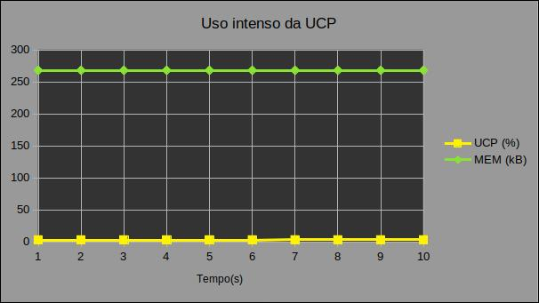
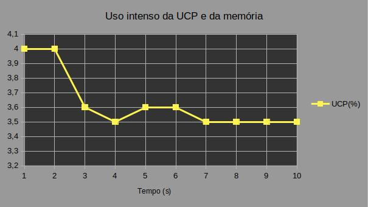
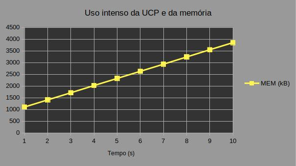
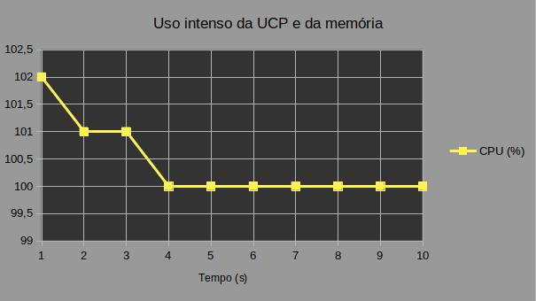
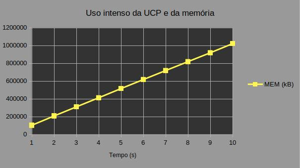

# Identificação

* Página do repositório do trabalho do <a href="https://github.com/gabriel-cesar/teaching"> GitHub</a>

* Discente 1
	* Nome: Gabriel César Olimpio Alves
	* Matrícula: 18110467
* Discente 2
	* Nome: Marcos Ivan de Almeida Melo
	* Matrícula: 18110498
* Discente 3
	* Nome: Yan Pires Siqueira Pequeno
	* Matrícula: 18111784
* Obs.: Distribuição igualitária da nota.

# Resultados

## Compilação e execução:

* Para a compilação do programa, sugerimos que seja feito com a seguinte estrutura.
	

		<ul>
			<li>gcc main.c -o main</li>
		</ul>
	

* Para a execução do mesmo, as estruturas serão das seguintes maneiras.
	

		<ul>
			<li>./main ucp</li>
			<li>./main ucp-mem</li>
		</ul>
	

## Utilização intensa da UCP

* Para podermos realizar a verificação da utilização da UCP, adicionamos uma função que gerará uma repetição na execução do seu escopo, como exemplificado abaixo.

	* for ( ; ; ){
	}

* Quando executada, a UCP realizou o loop continuamente até o momento em que o computador matou o processo pai, pois atingiu o limite de execução da máquina. Como o uso da UCP estava elevado (Figura 1) resolvemos adicionar a função “usleep()”, para que a UCP interrompa o processo por um certo intervalo de tempo, definido entre os parênteses do comando, na escala de milissegundos (em UNIX). Feito isso, a função ficou com a seguinte formatação:

	* for ( ; ; ) {
		usleep(100);
	}

* Com as mudanças já efetuadas, pudemos notar uma diminuição absurda na utilização da UCP (Figura 2). Lembrando que, para quaisquer que sejam os valores de parâmetro da função “usleep()”, a constância dos resultados se mantém, ou seja, a alteração do valor apenas altera o tempo em que o programa será pausado, alterando, assim, o valor de utilização da UCP, sendo essa relação inversamente proporcional.

	
Figura 1	 
		 
	

	
Figura 2  
		
	

* Analisando o gráfico presente na figura 2, é fácil ver que a UCP sofreu de uma grande alteração na utilização em relação ao teste anterior e permanecendo quase que constante durante todo o processo. Dessa forma, optamos por remover o comando "usleep()", pois é necessario o uso intenso da CPU nesse teste.

## Utilização intensa da UCP e memória

* Já para verificar a utilização da UCP e da memória RAM de forma concomitante, foi adicionada, primeiramente, a função da seguinte forma.
	* for ( ; ; ){
		malloc (sizeof (int) );
	}

* Assim como no experimento anterior, percebemos dificuldade por parte do computador, porém, agora, ocorreu um travamento, precisando forçar o desligamento, pois agora, além da utilização da UCP, estava ocorrendo de forma simultânea um alocamento de memória de forma elevada, gerado pela função “malloc()”. Após isso, resolvemos tomar a mesma medida e adicionar o comando “usleep()”, ficando com a seguinte face.

	* for ( ; ; ){
		malloc (sizeof (int) );
		usleep (100);
	}

* Como no teste da UCP, conseguimos limitar o uso dela e da memória ao acrescentar o comando “usleep()” (Figura 3 e 4). Porém, como no teste anterior, houve uma drástica redução e, como não era o propósito do teste, tivemos que alterá-lo usando os seguintes comando:
	* clock_t start_t, end_t, elapsed_t;
        start_t = clock(); 
        for(;;){
            end_t = clock(); 
            elapsed_t = (double)(end_t - start_t) / CLOCKS_PER_SEC;
            if (elapsed_t <= 10.0000){
                malloc(10 * sizeof(int));
            }
        }
* E assim, obtivemos uma alta alocação de memória e um alto uso da UCP (Figura 5 e 6).

Figura 3 
			

Figura 4 
	

Figura 5 
	

Figura 6 
	

# Discussão
	
## Utilização intensa da UCP

* 

TODO: explicar se o comportamento da curva **UCP** foi o esperado, sempre justificando sua resposta, referenciando o código fonte do programa e o gráfico do experimento realizado.

## Utilização intensa da UCP e memória

TODO: explicar se o comportamento da curva **UCP-MEM** foi o esperado, sempre justificando sua resposta, referenciando o código fonte do programa e o gráfico do experimento realizado.